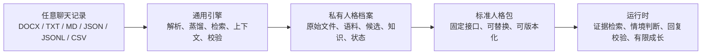
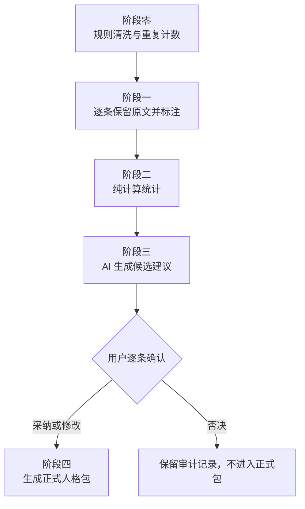

# Chat Persona Engine

## 零残留替换与完整重建

当前版本把“删除旧人物”和“导入新人物”做成了一条受控链路。执行
`profile-reset --confirm DELETE-ALL-PROFILES` 会清空私有 `.runtime/`，包括
原聊天、语料、候选、底层人格、记忆、语言规范、用户画像、修正记录、
上下文、成长快照、运行状态和当前档案指针，但完整保留通用引擎及五阶段流程。

新聊天导入后不会继承任何旧人物内容，`knowledge/` 在阶段四以前保持为空。
用户逐条完成 `adopt`、`modify` 或 `reject` 后，系统才从确认结果自动装配新的
人格、记忆、语言、场景、用户侧画像、来源清单和空白运行区，并为每个文件记录
SHA-256。源文件或知识层有缺失、被修改、仍未确认时，档案都不能激活。

```powershell
python gagale-skill/scripts/gagale_runtime.py --json profile-reset `
  --confirm DELETE-ALL-PROFILES
python gagale-skill/scripts/gagale_runtime.py --json profile-inspect `
  --source "<新的聊天记录>"
python gagale-skill/scripts/gagale_runtime.py --json profile-import `
  --source "<新的聊天记录>" `
  --profile-id "<新档案-id>" `
  --target-speaker "<目标说话人>"
```

把聊天记录蒸馏成可审计、可确认、可替换的人格语料包，而不是把一个人物写死在提示词里。

`gagale-skill` 是一个面向 Codex Skill 的通用聊天人格产品。它可以导入 DOCX、TXT、Markdown、JSON、JSONL 或 CSV 对话记录，经过证据保全、确定性清洗、逐条标注、可复现统计、候选生成和人工确认，最终生成可供对话引擎稳定消费的标准人格包。

它最初来自一个单角色原型，现在已经升级为角色无关、资料私有、档案隔离的通用引擎。换一个人物，不需要改代码或重写引擎，只需要导入新的聊天记录并重新完成确认流程。

## 为什么需要它

常见的人格模拟通常从一段人设提示词开始：人工总结“她是什么样的人”，再让模型模仿。这种做法快，但很难回答几个关键问题：

- 某个性格结论究竟来自哪条原话；
- 高频习惯和偶发异常是否被混为一谈；
- 统计数字能否从原始语料重新计算；
- AI 生成的总结是否被误当成了真实事实；
- 新的对话是否会悄悄改写长期人格；
- 多个人物的数据是否可能串档。

Chat Persona Engine 把这些风险变成明确的产品边界：原话是证据，统计是计算，AI 输出只是候选，用户确认才是事实。

## 核心架构

产品由三个相互隔离的层组成：



### 1. 通用引擎

仓库提交的 `gagale-skill/` 只保存通用能力：

- 多格式聊天解析与说话人识别；
- 五阶段语料蒸馏；
- 证据检索与上下文组装；
- 时间、状态和场景判断；
- 回复约束与失真校验；
- 记忆候选、成长快照、差异比较和回滚。

引擎不包含任何具体人物的姓名、关系、喜好、纪念日、原始聊天或私有路径。

### 2. 私有人格档案

每次导入都会创建独立档案：

```text
.runtime/
  active_profile.json
  profiles/
    <profile-id>/
      profile.json
      source/
        original.<format>
      corpus/
      package/
      knowledge/
      state.json
      snapshots/
```

所有路径从当前 `profile-id` 解析，一个档案不能读取另一个档案。整个 `.runtime/` 默认被 Git 忽略，原始聊天和确认后的人格数据不会进入公开仓库。

### 3. 标准人格包

对话引擎只依赖确认后的标准接口：

```text
语料包/
  corpus/
  stats.json
  constitution.json
  growth_seed.json
  scenario_map.json
  voice_index.md
  user_profile.md
  cleaning_log.md
```

因此，人物可以替换，引擎保持不变；引擎也可以升级，而不必重新混入某个人的私有资料。

## 五阶段蒸馏



### 阶段零：确定性清洗

只允许规则删除系统消息、空导出片段、通知和其他非本人表达。语气词、寒暄、重复表达、图片或表情标记都必须保留。近似重复只建立分组并记录真实次数，不从证据流中消失。

### 阶段一：证据标注

每条目标人物表达生成独立记录。`raw_text` 必须与解析出的原文完全一致，并带有 SHA-256、来源消息 ID、前文、话题、频率、时期、情绪和异常标记。标签用于检索，不拥有改写原话的权力。

### 阶段二：可复现统计

话题比例、频率分层、时间分布、长度、标点、短语和字符组合都只从 `corpus/` 计算。统计结果记录输入字段和完整性哈希，不允许模型把主观判断塞进数字。

### 阶段三：候选生成

AI 可以提出记忆锚点、语言索引、C4 八维初值、宪法边界、场景映射和用户侧写，但每一项都保持 `pending_user_confirmation`，并关联证据或统计依据。此时正式人格文件故意不存在。

### 阶段四：逐条确认

用户必须对每项候选执行采纳、修改或否决。遗漏任何一项都会阻止正式包生成；宪法级候选不能批量通过。确认后才允许激活档案并进入正常对话。

## 运行时不是“套提示词”

完成蒸馏后，每轮对话按固定链路运行：

1. 解析当前档案，拒绝跨档案路径。
2. 更新时区、时间段、近期上下文和状态。
3. 判断当前场景和需要的回应动作。
4. 只从当前档案检索原始证据。
5. 组合已确认人格、上下文和证据生成回复。
6. 检查身份泄漏、助手腔、可见推理、重复和无依据事实。
7. 只写回短期状态；新长期事实继续进入待确认队列。

这让产品覆盖“导入前检查、离线蒸馏、人工治理、在线生成、运行校验、长期成长”完整闭环，而不只是一个静态人格提示词。

## 与公开方案的区别

下面的对比讨论的是产品关注点，不是声称在所有能力上取代其他框架。Mem0、LangMem、Graphiti 和 Letta 都是成熟的通用记忆或状态基础设施；Chat Persona Engine 的差异化方向，是把“从历史聊天建立一个可审计人格”做成一条独立、严格、可交付的生产线。

| 维度 | 人设提示词 | 通用 RAG | 通用记忆框架 | Chat Persona Engine |
|---|---|---|---|---|
| 主要目标 | 描述角色 | 找相关文本 | 记住事实与交互 | 从聊天生产可运行人格包 |
| 原话证据 | 通常被概括 | 保留文档块 | 依框架而异 | `raw_text` 原文、来源 ID、哈希 |
| 清洗与统计 | 通常没有 | 通常没有人格统计 | 重点不在离线统计 | 规则清洗与纯计算统计强制分离 |
| 高频与异常 | 容易混淆 | 依检索结果 | 依提取策略 | 重复计数、频率分层、异常专审 |
| AI 权限 | 可直接定义人格 | 可直接生成回答 | 可自动写入或整理记忆 | 只能生成候选，不能替用户确认 |
| 人工闸门 | 手工改提示词 | 通常没有 | 可由应用自行设计 | 全量逐项确认，缺一项即阻断 |
| 多人物隔离 | 靠人工复制 | 靠索引或命名空间 | 通常支持用户或会话作用域 | 源文件、语料、知识、状态全档案隔离 |
| 运行校验 | 很少 | 关注召回 | 关注记忆与状态 | 检索、情境、回复约束、有限成长一体化 |
| 交付形态 | 一段提示词 | 向量库 | SDK、服务或存储层 | 可版本化的标准人格包 |

公开资料显示：[Mem0](https://github.com/mem0ai/mem0) 定位为 AI Agent 的通用记忆层；[LangMem](https://langchain-ai.github.io/langmem/) 提供对话信息抽取、记忆整合和提示优化；[Graphiti](https://github.com/getzep/graphiti) 专注带时间与来源关系的上下文图；[Letta](https://docs.letta.com/guides/core-concepts/memory/memory-blocks) 以可持续更新的 memory blocks 构建有状态 Agent。它们适合承担长期记忆、图谱、存储或 Agent 状态基础设施。

本项目更适合以下情况：你拥有一批历史聊天，希望先完成证据保全、语言统计、人格候选和人工确权，再把结果交给运行时。两类能力也可以组合使用：本项目负责人格蒸馏与治理，通用记忆框架负责更大规模的在线存储和检索。

## 关键升级

| 原型阶段 | 当前产品版本 |
|---|---|
| 单一角色与代码绑定 | 引擎与人物完全分离 |
| 资料散落在公开目录 | 原始资料集中到 Git 忽略的私有档案 |
| 依赖单一聊天格式 | 支持六种常见导出格式 |
| 一次性总结人格 | 五阶段、可中断、可审计的蒸馏流程 |
| AI 结论直接进入设定 | AI 仅提候选，用户逐条确权 |
| 单份全局状态 | 每个人物独立语料、知识、状态和快照 |
| 静态提示词驱动 | 证据检索、上下文、校验和有限成长闭环 |
| 难以回到原话核查 | 原文、来源 ID、哈希、统计和审计日志互相追溯 |

## 快速开始

先检查文件和说话人，不立即创建人格：

```powershell
python gagale-skill/scripts/gagale_runtime.py --json profile-inspect `
  --source "<聊天记录文件>"
```

确认目标说话人后，创建独立档案并运行阶段零至阶段三：

```powershell
python gagale-skill/scripts/gagale_runtime.py --json profile-import `
  --source "<聊天记录文件>" `
  --profile-id "<profile-id>" `
  --target-speaker "<目标说话人>"
```

逐条编辑生成的 `candidates/review_template.json`，然后执行确认并激活：

```powershell
python gagale-skill/scripts/gagale_runtime.py --profile "<profile-id>" --json corpus-confirm `
  --decisions "<package-dir>/candidates/review_template.json" `
  --activate
```

构建一次完整的对话上下文和证据包：

```powershell
python gagale-skill/scripts/gagale_runtime.py --json orchestrate `
  --user-message "<最新消息>"
```

完整命令与边界见 [SKILL.md](gagale-skill/SKILL.md)，架构说明见 [architecture.md](gagale-skill/references/framework/architecture.md)，蒸馏合同见 [corpus-distillation.md](gagale-skill/references/workflows/corpus-distillation.md)。

## 质量与安全边界

- 原始聊天保存在私有 `.runtime`，不会作为产品模板提交。
- 导入时固定源文件 SHA-256，源文件变化会阻止激活。
- `raw_text` 不允许改写、润色或概括。
- 阶段三不会提前生成正式人格文件。
- 所有候选必须逐条处理，异常表达和宪法边界需要重点复核。
- 新生成的对话不能回写为历史证据。
- 长期成长需要提议、确认、快照和可回滚记录。
- 校验通过只代表结构与护栏通过，最终相似度仍需结合证据和盲测判断。

当前自动化测试覆盖多格式导入、五阶段阻断、原文完整性、源文件篡改检测、双档案隔离、运行时状态隔离与确认后激活。

## 仓库说明

本仓库同时保留 PMP 新媒体运营管理应用；`gagale-skill/` 是其中独立发布、可安装、可迁移的 Chat Persona Engine 产品目录。角色私有资料不属于公开产品。

推广介绍与发布口径见 [launch-kit.md](docs/launch-kit.md)。
